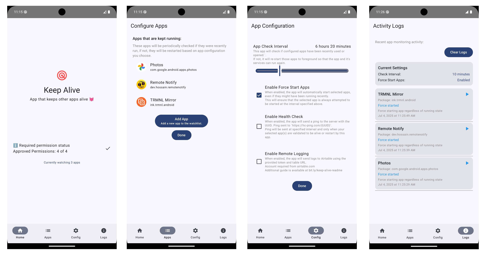

 

# Keep Alive 💓
A simple app to keep specific apps alive by checking if they are running. If not, they will be attempted* to start for you.

## 🛑 **STOP** 🛑 - Know before you use ✋
This app is designed with a very specific use case in mind. It is important to understand what this app does and how.

* App is designed to be **_always_** running in the foreground to watch and restart other applications.
* App is **NOT** optimized for battery and will cause high battery 🪫 drain. Ideally, this **should not** be used on your primary phone that you use daily.
    * ℹ️ I use this on a secondary phone plugged into a power cable 24/7.
* App contains some additional features like [Remote Logging](REMOTE-MONITORING.md) and [Heartbeat](REMOTE-HEARTBEAT.md) due to my personal needs. However, the app can be used without enabling those features.
* See the permission section below to better understand the app.

### Limitations 💔
Despite having many needed permissions, this app may still not work due to the strict security of Android. 
* One known issue is related to receiving `RECEIVE_BOOT_COMPLETED` event that is needed to start the watchdog service of this app. However, the `RECEIVE_BOOT_COMPLETED` event is not delivered until user unlocks the device after phone is restarted or incase phone got soft-started because of very low memory pressure.
  * In that case, this "Keep Alive" app will fail to start configured apps until the device is unlocked manually. (See https://github.com/hossain-khan/android-keep-alive/issues/70 for technical details)
* Another known issue is, even though foreground service is running, it does not trigger the periodic checks based on your configured interval. I have noticed this happen in Samsung Galaxy S23, on other phone it works. So, there might be some bug or manufacturer or device specific issue. Take a look into "Monitor Activity" to see how checks are doing.

### 📚 How to use the app
1. Launch the app and accept all the required permissions.
2. Once all permission are active, you will see 2 options
    1. Configure apps that should be running
    2. Configure app settings like interval of checking for app
3. Add app that you want to be checked periodically
4. Done ✔️
    1. This app will always run in the foreground, continuously checking if your selected apps are active. If any are not, it will automatically restart them for you.  

#### 🎥 Video Demo
https://github.com/user-attachments/assets/8bf71b38-9fb4-43a4-8ee6-ab27d743c202

## 🔐 Sensitive permissions required ⚠️

Here is the list of permissions needed for the service class ([`WatchdogService`](https://github.com/hossain-khan/android-keep-alive/blob/main/app/src/main/java/dev/hossain/keepalive/service/WatchdogService.kt)). [Source: [`AndroidManifest.xml`](https://github.com/hossain-khan/android-keep-alive/blob/main/app/src/main/AndroidManifest.xml)]

Here are the permissions needed for the app along with a summary of why they are needed:

1. **`android.permission.INTERNET`**:
   - **Reason**: Required to send logs to an API endpoint and send heartbeat check. Both are optional and configurable in the app.

2. **`android.permission.FOREGROUND_SERVICE`**:
   - **Reason**: Allows the app to run a foreground service, which is necessary for the `WatchdogService` to monitor other apps and keep them alive by restarting them.

3. **`android.permission.FOREGROUND_SERVICE_SPECIAL_USE`**:
   - **Reason**: Required for special use cases of foreground services, as indicated by the `WatchdogService`.

4. **`android.permission.RECEIVE_BOOT_COMPLETED`**:
   - **Reason**: Allows the app to receive the `BOOT_COMPLETED` broadcast, enabling it to start itself and monitor the apps that are configured to keep alive.

5. **`android.permission.REQUEST_IGNORE_BATTERY_OPTIMIZATIONS`**:
   - **Reason**: Needed to request the user to exclude the app from battery optimizations, ensuring the app and it's `WatchdogService` can run continuously without being restricted by the system.

6. **`android.permission.POST_NOTIFICATIONS`**:
   - **Reason**: Allows the app to post notifications, which is essential for notifying users about ongoing watchdog activity.

7. **`android.permission.QUERY_ALL_PACKAGES`**:
   - **Reason**: Required to query and interact with all installed packages, which is necessary for the app's functionality to monitor and select apps in the app settings.

8. **`android.permission.PACKAGE_USAGE_STATS`**:
   - **Reason**: Allows the app to access usage statistics, which is necessary for knowing if specific apps have been recently used.

9. **`android.permission.SYSTEM_ALERT_WINDOW`**:
   - **Reason**: Required to draw overlays on top of other apps, which is necessary for certain UI elements or notifications that need to be displayed over other apps. And also start other apps from the background service.

Most of the permissions listed above are discouraged and or restricted. Please be sure to use the app with caution.

## 🤝 Contributing

Contributions are welcome! Please read our [CONTRIBUTING.md](CONTRIBUTING.md) for guidelines before submitting a pull request.

---
> \* = _The app uses Android’s standard explicit intent to start an app by its package ID. The intent is sent to the Android OS to request the app to run, but it is ultimately up to the OS whether the app will actually be started._
---
