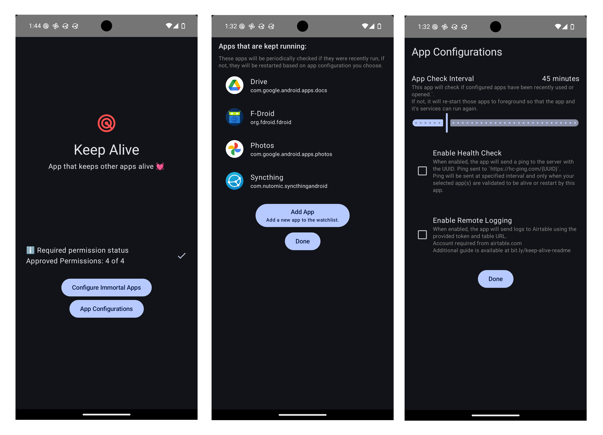

# Keep Alive 💓
A simple app to keep specific apps alive by checking if they are running. If not, they will be launched.

## 🔐 Questionable permissions required ⚠️

Here is the list of permissions needed for the service class ([`WatchdogService`](https://github.com/hossain-khan/android-keep-alive/blob/main/app/src/main/java/dev/hossain/keepalive/service/WatchdogService.kt)). [Source: [Stackoverflow](https://android.stackexchange.com/a/258241/5002)]

Here are the permissions needed for the app along with a short summary of why they are needed:

1. **`android.permission.INTERNET`**:
   - **Reason**: Required to send logs to an API endpoint and send heartbeat check. Both are optional and configurable in the app.

2. **`android.permission.FOREGROUND_SERVICE`**:
   - **Reason**: Allows the app to run a foreground service, which is necessary for the `WatchdogService` to monitor other apps and keep them alive by restarting them.

3. **`android.permission.FOREGROUND_SERVICE_SPECIAL_USE`**:
   - **Reason**: Required for special use cases of foreground services, as indicated by the `WatchdogService`.

4. **`android.permission.RECEIVE_BOOT_COMPLETED`**:
   - **Reason**: Allows the app to receive the `BOOT_COMPLETED` broadcast, enabling it to start itself and monitor the apps that are configured to keep alive.

5. **`android.permission.REQUEST_IGNORE_BATTERY_OPTIMIZATIONS`**:
   - **Reason**: Needed to request the user to exclude the app from battery optimizations, ensuring the app and it's `WatchdogService` can run continuously without being restricted by the system.

6. **`android.permission.POST_NOTIFICATIONS`**:
   - **Reason**: Allows the app to post notifications, which is essential for notifying users about ongoing watchdog activity.

7. **`android.permission.QUERY_ALL_PACKAGES`**:
   - **Reason**: Required to query and interact with all installed packages, which is necessary for the app's functionality to monitor and select apps in the app settings.

8. **`android.permission.PACKAGE_USAGE_STATS`**:
   - **Reason**: Allows the app to access usage statistics, which is necessary for knowing if specific apps have been recently used.

9. **`android.permission.SYSTEM_ALERT_WINDOW`**:
   - **Reason**: Required to draw overlays on top of other apps, which is necessary for certain UI elements or notifications that need to be displayed over other apps. And also start other apps from the background service.

Most of the permissions listed above are discouraged and or restricted. Please be sure to use the app with caution.
