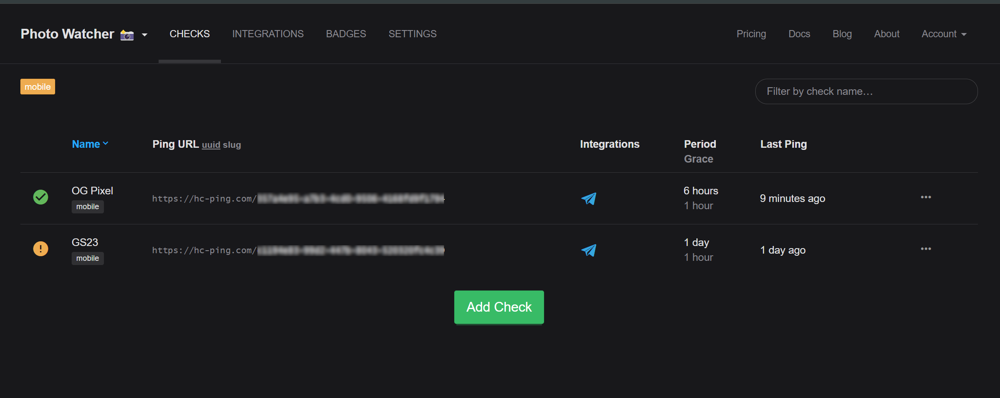
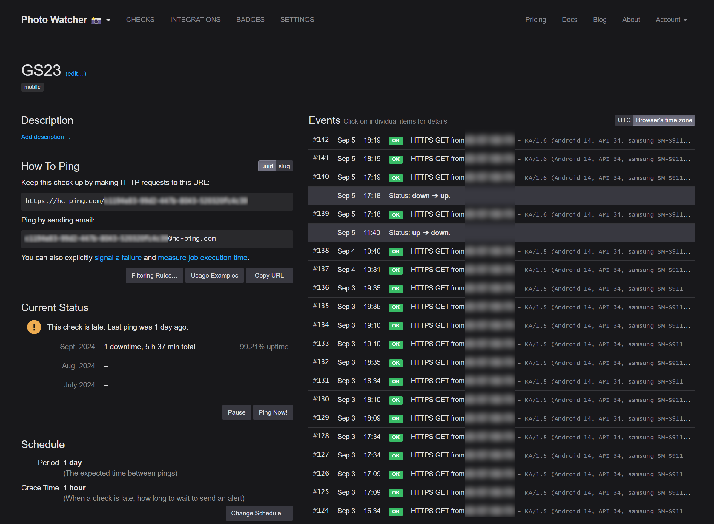
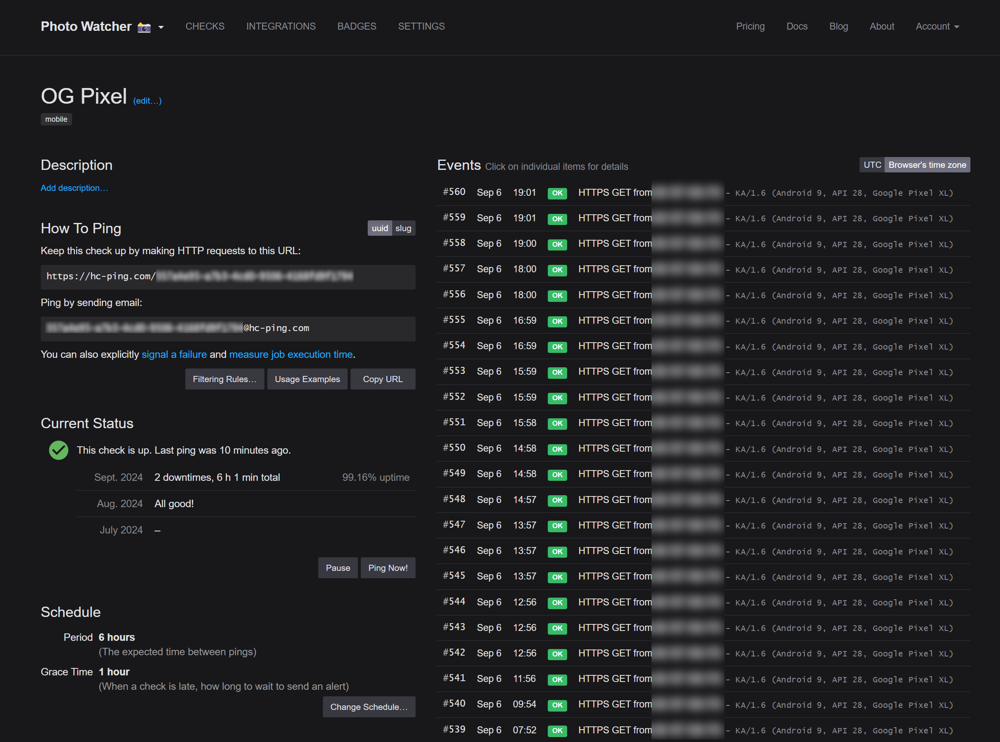

# Remote Heartbeat Check
This feature is designed to send a heartbeat signal to a remote server to indicate that the app is running. 
This is useful to monitor the app's health and uptime.

Currently only https://healthchecks.io/ is supported.

## How to configure Healthchecks.io
1. Create a new check on [Healthchecks.io](https://healthchecks.io/)
2. Copy the UUID from the URL of the check  
    i. Example UUIDs (generated): `59064aca-5e5e-4f3f-b2aa-5d0bf55d3761`, `d69df764-b9b8-4743-8846-3f08bd55c767`, and so on.
4. Paste the URL in the app's settings
5. Enable the feature from the app's settings
6. Done!

## Demo

